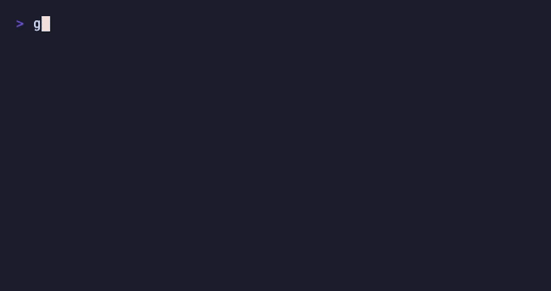

# bubble-prompt

[中文](README_zh.md)

An interactive CLI completion framework built on the [Bubble Tea](https://github.com/charmbracelet/bubbletea) ecosystem.

> A modern, elegant drop-in replacement for go-prompt — no more garbled output from rapid keystrokes.



## Features

- **Reliable** — MVU architecture rebuilds the View from scratch every frame; fast or repeated keystrokes never corrupt output
- **Beautiful** — lipgloss rounded popup, dual-column layout (completion text + description), adapts to terminal width
- **Composable** — ships as a standard `tea.Model`, embeds seamlessly into any Bubble Tea application
- **Easy to migrate** — API mirrors go-prompt; most projects only need to update the import path

## Quick Start

```bash
go get github.com/rynvaro/bubble-prompt
```

```go
package main

import (
    "fmt"
    "log"

    prompt "github.com/rynvaro/bubble-prompt"
)

func main() {
    p := prompt.New(
        func(input string) error {
            fmt.Println("exec:", input)
            return nil
        },
        func(d prompt.Document) []prompt.Suggestion {
            return prompt.FilterHasPrefix([]prompt.Suggestion{
                {Text: "get",    Description: "fetch a resource"},
                {Text: "set",    Description: "update a resource"},
                {Text: "delete", Description: "remove a resource"},
            }, d.CurrentWord(), true)
        },
        prompt.WithPrefix(">>> "),
    )
    if err := p.Run(); err != nil {
        log.Fatal(err)
    }
}
```

## Key Bindings

| Key | Action |
|-----|--------|
| `Tab` | Trigger completion / select next item |
| `Shift+Tab` | Select previous item |
| `↑` / `↓` | History navigation (popup closed) / completion navigation (popup open) |
| `Enter` | Submit input (popup open: accept selected item) |
| `Esc` | Close completion popup |
| `←` / `→` | Move cursor |
| `Ctrl+A` / `Home` | Move to line start |
| `Ctrl+E` / `End` | Move to line end |
| `Ctrl+W` | Delete word before cursor |
| `Ctrl+U` | Delete to line start |
| `Ctrl+K` | Delete to line end |
| `Ctrl+C` / `Ctrl+D` | Quit |

## Roadmap

- [x] v0.1 — Basic REPL, Tab completion, history navigation, lipgloss popup
- [ ] v0.2 — Fuzzy match highlighting, popup auto-flip, grouped completions
- [ ] v0.3 — Async completion, syntax highlighting, multi-line input
- [ ] v0.4 — Cobra integration, file path completion

## License

MIT
